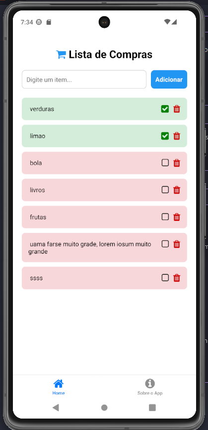
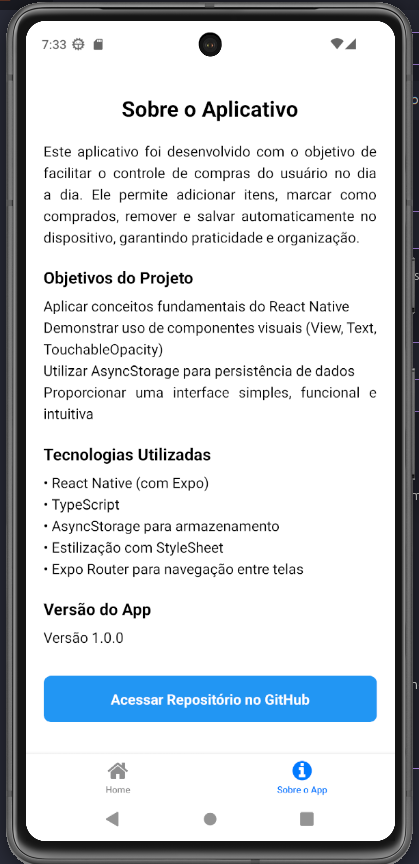

# App Lista de Compras

Um aplicativo simples e intuitivo para gerenciar sua lista de compras, desenvolvido em React Native com Expo.

## 📱 Funcionalidades

- ✅ Adicionar itens à lista
- ✅ Marcar itens como comprados
- ✅ Editar itens
- ✅ Remover itens (clique no icone ou pressione e segure)
- ✅ Persistência de dados local
- ✅ Interface responsiva e intuitiva

## 🚀 Tecnologias Utilizadas

- **React Native** com Expo
- **TypeScript**
- **AsyncStorage** para armazenamento local
- **Expo Router** para navegação
- **FontAwesome** para ícones

## 📋 Pré-requisitos

- Node.js (versão 18 ou superior)
- npm ou yarn
- Expo CLI
- Expo Go (para testar no dispositivo)

## 🔧 Instalação

1. **Clone o repositório:**

```bash
git clone https://github.com/lauanderson-rael/rn-shopping-list
cd rn-shopping-list
```

2. **Instale as dependências:**

```bash
npm install
```

3. **Inicie o projeto:**

```bash
npx expo start
```

4. **Execute no dispositivo:**
   - Baixe o app **Expo Go** na Play Store/App Store
   - Escaneie o QR Code que aparece no terminal
   - Ou pressione `a` para Android ou `i` para iOS (se tiver simulador)

## 📱 Telas do Aplicativo

### Tela Principal (Home)

- Digite o nome do item no campo de texto
- Toque em "Adicionar" para incluir na lista
- Toque no item para marcar/desmarcar como comprado
- Pressione e segure o item para removê-lo



### Tela Sobre

- Informações sobre o aplicativo
- Tecnologias utilizadas
- Link para o repositório



## 📁 Estrutura do Projeto

```
app-shopping-list/
├── app/
│   ├── _layout.tsx          # Layout principal com navegação
│   ├── index.tsx            # Tela inicial
│   ├── home.tsx             # Tela principal da lista
│   └── about.tsx            # Tela sobre o app
├── components/
│   ├── ConfirmModal.tsx     # Modal de confirmação
│   ├── EditModal.tsx        # Modal de edição
│   ├── InputItem.tsx        # Componente de input
│   └── ListItem.tsx         # Componente de item da lista
├── hooks/
│   └── useShoppingList.ts   # Hook personalizado
├── styles/
│   ├── home.ts              # Estilos da tela home
│   └── about.ts             # Estilos da tela sobre
├── utils/
│   └── storage.ts           # Utilitários de armazenamento
├── types/
│   └── item.ts              # Tipos do item
└── assets/                  # Imagens e recursos
```

## 🎨 Personalização

### Cores do Tema (Claro)

As cores principais estão definidas nos arquivos de estilo:

- Azul principal: `#2196F3`
- Branco principal: `#FFFFFF`

### Ícones

O app utiliza FontAwesome. Para alterar ícones, consulte a [documentação do FontAwesome](https://fontawesome.com/icons).

## 📦 Build para Produção

### Android (APK)

```bash
npx expo build:android
```

### iOS (IPA)

```bash
npx expo build:ios
```

## 👨‍💻 Desenvolvedor

**Lauanderson Rael**

- GitHub: [@lauanderson](https://github.com/lauanderson-rael)

---

⭐ Se este projeto te ajudou, considere dar uma estrela no repositório!
